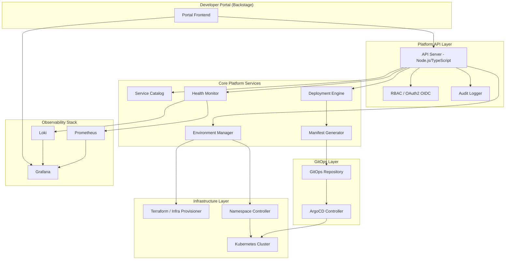
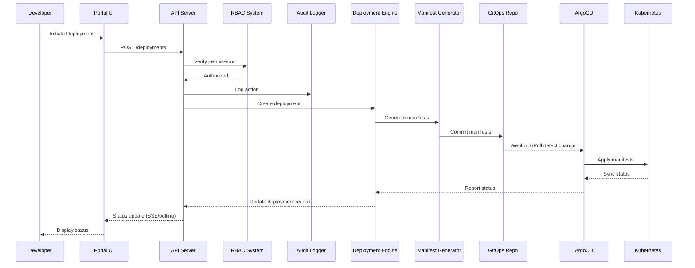

# Design Document: Internal Developer Platform

## Overview

The Internal Developer Platform (IDP) is a production-grade system providing a unified developer portal for service catalog management, deployment workflows, environment provisioning, observability, and security governance. It follows a GitOps-driven architecture with Kubernetes as the runtime platform, ArgoCD for continuous delivery, and Terraform for infrastructure provisioning.

The system is structured as a monorepo using pnpm workspaces with Turborepo for build orchestration. The frontend is a Backstage-based portal, the backend is a Node.js/TypeScript API server, and infrastructure is managed through Terraform modules and Kubernetes manifests.

### Key Design Goals

- **GitOps-first**: All cluster state is version-controlled in Git; ArgoCD reconciles desired state
- **Self-service**: Developers can register services, deploy, provision environments, and view observability data without platform team intervention
- **Security by default**: RBAC, audit logging, network isolation, and secret encryption are built-in
- **Reproducibility**: Terraform modules and Kubernetes manifests ensure infrastructure is declarative and reproducible
- **Developer experience**: Single-command setup, consistent tooling, and fast feedback loops

## Architecture

### High-Level Architecture



### Monorepo Structure

```
internal-developer-platform/
├── apps/
│   ├── portal/          # Backstage-based frontend (React/TypeScript)
│   └── api/             # Backend API server (Node.js/TypeScript/Express)
├── packages/
│   ├── shared/          # Shared TypeScript interfaces, types, utilities
│   ├── config/          # Shared configuration schemas and defaults
│   └── ui/              # Shared UI components for the portal
├── infra/
│   ├── terraform/       # Terraform modules (networking, compute, database, monitoring, security)
│   ├── kubernetes/      # Base Kubernetes manifests and templates
│   └── argocd/          # ArgoCD application definitions and configurations
├── docs/                # Architecture docs, ADRs, runbooks
├── scripts/             # Developer setup, CI helpers, utility scripts
├── .github/
│   └── workflows/       # GitHub Actions CI/CD pipeline definitions
├── docker-compose.yml   # Local development environment
├── turbo.json           # Turborepo pipeline configuration
├── pnpm-workspace.yaml  # pnpm workspace definitions
└── package.json         # Root package.json with shared scripts
```

### Request Flow



## Components and Interfaces

### 1. Portal (Frontend Application)

**Technology**: Backstage framework (React, TypeScript, Material UI)

**Responsibilities**:

- Service catalog browsing and registration UI
- Deployment initiation and status tracking
- Environment provisioning interface
- Observability dashboards (embedded Grafana)
- Configuration management UI
- Deployment history and rollback controls

**Key Interfaces**:

```typescript
// Portal communicates with API Server via REST
interface PortalAPIClient {
  // Catalog
  registerEntity(entity: CatalogEntityInput): Promise<CatalogEntity>;
  searchEntities(query: string): Promise<CatalogEntity[]>;

  // Deployments
  createDeployment(action: DeploymentActionInput): Promise<Deployment>;
  getDeploymentStatus(id: string): Promise<DeploymentStatus>;
  getDeploymentHistory(serviceId: string, limit?: number): Promise<Deployment[]>;
  requestRollback(serviceId: string, environment: string): Promise<Deployment>;

  // Environments
  provisionEnvironment(request: EnvironmentRequest): Promise<Environment>;
  listEnvironments(): Promise<Environment[]>;

  // Configuration
  getConfig(serviceId: string, environment: string): Promise<ConfigMap>;
  updateConfig(serviceId: string, environment: string, values: ConfigUpdate): Promise<ConfigMap>;
}
```

### 2. API Server (Backend)

**Technology**: Node.js, TypeScript (strict mode), Express, Zod for validation

**Responsibilities**:

- REST API endpoint handling with schema validation
- Request routing and middleware (auth, audit, validation)
- OpenAPI specification generation from route definitions
- Orchestration of platform services

**Key Interfaces**:

```typescript
// Request validation middleware
interface ValidationMiddleware {
  validateBody<T>(schema: ZodSchema<T>): RequestHandler;
  validateQuery<T>(schema: ZodSchema<T>): RequestHandler;
  validateParams<T>(schema: ZodSchema<T>): RequestHandler;
}

// Error response format
interface APIErrorResponse {
  error: string; // Human-readable description
  code: string; // Machine-readable identifier
  details: Array<{
    // Specific violations (max 50)
    field?: string;
    message: string;
    constraint?: string;
  }>;
}
```

### 3. Service Catalog

**Technology**: PostgreSQL for persistence, with in-memory caching for search

**Responsibilities**:

- Entity registration, validation, and persistence
- Search with case-insensitive substring matching
- Unique constraint enforcement (name within namespace)
- Version history tracking
- Dependency graph management

**Key Interfaces**:

```typescript
interface ServiceCatalog {
  register(entity: CatalogEntityInput, actor: Actor): Promise<CatalogEntity>;
  search(query: string, limit?: number): Promise<CatalogEntity[]>;
  getById(id: string): Promise<CatalogEntity | null>;
  update(id: string, updates: Partial<CatalogEntityInput>, actor: Actor): Promise<CatalogEntity>;
  getVersionHistory(id: string, limit?: number): Promise<CatalogEntityVersion[]>;
  addDependency(source: string, target: string, type: DependencyType): Promise<void>;
  removeDependency(source: string, target: string): Promise<void>;
  getDependencies(entityId: string): Promise<DependencyEdge[]>;
}
```

### 4. Deployment Engine

**Technology**: Node.js service with state machine for deployment lifecycle

**Responsibilities**:

- Deployment request validation and creation
- Deployment lifecycle management (pending → in_progress → success/failed)
- Concurrent deployment prevention (per service+environment)
- Rollback orchestration
- Status reporting

**Key Interfaces**:

```typescript
interface DeploymentEngine {
  create(action: DeploymentActionInput, actor: Actor): Promise<Deployment>;
  getStatus(deploymentId: string): Promise<DeploymentStatus>;
  getHistory(serviceId: string, environment?: string, limit?: number): Promise<Deployment[]>;
  rollback(serviceId: string, environment: string, actor: Actor): Promise<Deployment>;
  updateStatus(deploymentId: string, status: DeploymentStatusUpdate): Promise<void>;
  markFailed(deploymentId: string, error: DeploymentError): Promise<void>;
}

type DeploymentPhase =
  | 'pending'
  | 'validating'
  | 'generating_manifests'
  | 'committing'
  | 'syncing'
  | 'health_checking'
  | 'success'
  | 'failed'
  | 'rollback_failed';
```

### 5. Manifest Generator

**Technology**: Node.js, Handlebars/EJS templates, js-yaml for YAML generation

**Responsibilities**:

- Kubernetes manifest generation from templates
- Manifest validation against Kubernetes schemas
- Git commit and push to GitOps repository
- Conventional commit message formatting
- Retry logic for Git operations

**Key Interfaces**:

```typescript
interface ManifestGenerator {
  generate(deployment: Deployment, envConfig: EnvironmentConfig): Promise<ManifestSet>;
  validate(manifests: ManifestSet): Promise<ValidationResult>;
  commit(manifests: ManifestSet, message: string): Promise<CommitResult>;
  parseManifest(yaml: string): Promise<KubernetesManifest>;
  serializeManifest(manifest: KubernetesManifest): string;
}

interface ManifestSet {
  deployment: KubernetesManifest;
  service: KubernetesManifest;
  configMap: KubernetesManifest;
  path: string; // e.g., "environments/staging/my-service/"
}
```

### 6. Environment Manager

**Technology**: Node.js service interfacing with Kubernetes API and Terraform

**Responsibilities**:

- Environment provisioning (namespace, quotas, network policies, RBAC)
- Environment lifecycle management (creation, expiry, renewal, deprovisioning)
- Configuration and secret management per environment
- Environment limit enforcement
- Expiry notification scheduling

**Key Interfaces**:

```typescript
interface EnvironmentManager {
  provision(request: EnvironmentRequest, actor: Actor): Promise<Environment>;
  deprovision(environmentId: string, actor: Actor): Promise<void>;
  listByOwner(ownerId: string): Promise<Environment[]>;
  renew(environmentId: string, actor: Actor): Promise<Environment>;
  getConfig(serviceId: string, environmentId: string): Promise<ConfigMap>;
  setConfig(
    serviceId: string,
    environmentId: string,
    values: ConfigUpdate,
    actor: Actor,
  ): Promise<ConfigMap>;
  setSecret(
    serviceId: string,
    environmentId: string,
    key: string,
    value: string,
    actor: Actor,
  ): Promise<void>;
}

interface EnvironmentRequest {
  name: string;
  type: 'development' | 'staging' | 'production';
  team: string;
  expiryDays?: number; // defaults to 30
}
```

### 7. GitOps Controller (ArgoCD Integration)

**Technology**: ArgoCD with webhook notifications, Node.js adapter service

**Responsibilities**:

- Monitoring GitOps repository for changes
- Reporting sync status to Deployment Engine
- Automatic rollback on health check failures
- Sync timeout detection

**Key Interfaces**:

```typescript
interface GitOpsController {
  onSyncStatusChange(callback: (event: SyncEvent) => void): void;
  getSyncStatus(appName: string): Promise<SyncStatus>;
  triggerSync(appName: string): Promise<void>;
  rollback(appName: string, targetRevision: string): Promise<void>;
}

type SyncStatus = 'Syncing' | 'Synced' | 'OutOfSync' | 'Failed';
```

### 8. RBAC System

**Technology**: OAuth2/OIDC provider integration, custom permission evaluation engine

**Responsibilities**:

- Authentication via OAuth2/OIDC
- Role-based permission evaluation (viewer, developer, admin)
- Team-scoped permission resolution
- Session management and token validation
- Audit log recording

**Key Interfaces**:

```typescript
interface RBACSystem {
  authenticate(token: string): Promise<AuthenticatedUser>;
  authorize(user: AuthenticatedUser, action: Action, resource: Resource): Promise<AuthzResult>;
  getUserRoles(userId: string): Promise<RoleAssignment[]>;
  assignRole(userId: string, role: Role, team: string, actor: Actor): Promise<void>;
}

interface AuthenticatedUser {
  id: string;
  email: string;
  teams: string[];
  roles: RoleAssignment[];
  sessionExpiry: Date;
}

type Role = 'viewer' | 'developer' | 'admin';

interface AuthzResult {
  allowed: boolean;
  reason?: string;
}
```

### 9. Health Monitor

**Technology**: Node.js service polling Kubernetes probes, Prometheus client

**Responsibilities**:

- Readiness/liveness probe collection
- Alert emission on consecutive failures
- Connectivity loss detection
- Deployment status updates

**Key Interfaces**:

```typescript
interface HealthMonitor {
  startMonitoring(deployment: Deployment): void;
  stopMonitoring(deploymentId: string): void;
  getHealth(serviceId: string, environment: string): Promise<HealthStatus>;
  onAlert(callback: (alert: HealthAlert) => void): void;
}

type HealthStatus = 'healthy' | 'degraded' | 'unknown';
```

### 10. Audit Logger

**Technology**: Append-only PostgreSQL table with integrity hashing

**Responsibilities**:

- Recording all state-changing actions
- Integrity verification (hash chain)
- Query with filtering and pagination
- Retention enforcement (1 year minimum)

**Key Interfaces**:

```typescript
interface AuditLogger {
  log(entry: AuditEntry): Promise<void>;
  query(filters: AuditQueryFilters): Promise<PaginatedResult<AuditEntry>>;
  verifyIntegrity(startTime: Date, endTime: Date): Promise<IntegrityResult>;
}

interface AuditEntry {
  actor: string; // User ID or system service name
  action: string; // Action performed
  resource: string; // Target resource identifier
  timestamp: Date; // UTC with millisecond precision
  outcome: 'success' | 'failure';
  reason?: string; // Failure reason if applicable
  metadata?: Record<string, unknown>;
}
```

### 11. Infra Provisioner

**Technology**: Terraform CLI wrapper, Node.js orchestration

**Responsibilities**:

- Terraform plan/apply orchestration
- Remote state management
- Module organization by concern
- Audit artifact recording
- Validation gate (fmt, validate)

**Key Interfaces**:

```typescript
interface InfraProvisioner {
  plan(module: string, variables: Record<string, unknown>): Promise<TerraformPlan>;
  apply(planId: string, actor: Actor): Promise<TerraformApplyResult>;
  validate(module: string): Promise<ValidationResult>;
  getState(module: string): Promise<TerraformState>;
}
```

## Data Models

### Catalog Entity

```typescript
interface CatalogEntity {
  id: string; // UUID
  name: string; // 1-128 chars, unique within namespace
  namespace: string; // Logical grouping identifier
  owner: string; // 1-128 chars
  description: string; // 1-1024 chars
  lifecycleStage: 'experimental' | 'development' | 'production' | 'deprecated';
  repositoryUrl: string; // Valid URL format
  tags: string[]; // 0-20 tags, each 1-64 chars
  version: number; // Auto-incremented on update
  createdAt: Date;
  updatedAt: Date;
  createdBy: string; // Registering user
  sourceRepository: string; // Source repository audit metadata
}

interface CatalogEntityVersion {
  entityId: string;
  version: number;
  data: CatalogEntity;
  changedBy: string;
  changedAt: Date;
}

interface DependencyEdge {
  sourceEntityId: string;
  targetEntityId: string;
  dependencyType: string;
  createdAt: Date;
}
```

### Deployment

```typescript
interface Deployment {
  id: string; // UUID
  serviceId: string; // Reference to CatalogEntity
  serviceName: string;
  version: string; // Artifact version
  environment: string; // Target environment name
  status: DeploymentStatus;
  type: 'forward' | 'rollback';
  actor: string; // User who initiated
  phases: DeploymentPhaseRecord[];
  createdAt: Date;
  updatedAt: Date;
  completedAt?: Date;
  error?: DeploymentError;
}

type DeploymentStatus = 'pending' | 'in_progress' | 'success' | 'failed' | 'rollback_failed';

interface DeploymentPhaseRecord {
  phase: DeploymentPhase;
  startedAt: Date;
  completedAt?: Date;
  progress: number; // 0-100
  error?: string;
}

interface DeploymentError {
  message: string;
  phase: DeploymentPhase;
  details?: Record<string, unknown>;
}
```

### Environment

```typescript
interface Environment {
  id: string; // UUID
  name: string;
  type: 'development' | 'staging' | 'production';
  namespace: string; // Kubernetes namespace name
  owner: string; // User who provisioned
  team: string;
  status: 'provisioning' | 'active' | 'expiring' | 'deprovisioning' | 'deleted';
  resourceQuota: ResourceQuota;
  labels: EnvironmentLabels;
  expiryDate: Date;
  createdAt: Date;
  updatedAt: Date;
}

interface ResourceQuota {
  cpuLimit: string; // e.g., "4" (cores)
  memoryLimit: string; // e.g., "8Gi"
  storageLimit: string; // e.g., "50Gi"
}

interface EnvironmentLabels {
  team: string;
  environmentType: string;
  createdBy: string;
  expiryDate: string; // ISO date string
}
```

### Configuration

```typescript
interface ConfigEntry {
  key: string;
  value: string;
  isSecret: boolean;
  serviceId: string;
  environmentId: string;
  version: number;
  updatedBy: string;
  updatedAt: Date;
}

interface ConfigSchema {
  serviceId: string;
  schema: Record<string, ConfigFieldSchema>;
}

interface ConfigFieldSchema {
  type: 'string' | 'number' | 'boolean' | 'url' | 'email';
  required: boolean;
  pattern?: string;
  min?: number;
  max?: number;
  description?: string;
}
```

### Audit Log

```typescript
interface AuditLogEntry {
  id: string; // UUID
  actor: string; // User ID or system service name
  action: string; // Action performed
  resource: string; // Target resource identifier
  timestamp: Date; // UTC with millisecond precision
  outcome: 'success' | 'failure';
  reason?: string; // Failure reason
  metadata?: Record<string, unknown>;
  integrityHash: string; // SHA-256 hash including previous entry hash
  previousHash: string; // Hash of the preceding entry (chain)
}
```

### RBAC

```typescript
interface RoleAssignment {
  userId: string;
  role: 'viewer' | 'developer' | 'admin';
  team: string;
  assignedBy: string;
  assignedAt: Date;
}

interface Permission {
  action: string;
  resource: string;
  conditions?: Record<string, unknown>;
}

// Permission matrix
const ROLE_PERMISSIONS: Record<Role, Permission[]> = {
  viewer: [{ action: 'read', resource: '*' }],
  developer: [
    { action: 'read', resource: '*' },
    { action: 'deploy', resource: 'non-production' },
    { action: 'provision', resource: 'environment' },
    { action: 'manage', resource: 'config' },
  ],
  admin: [{ action: '*', resource: '*' }],
};
```

## Correctness Properties

_A property is a characteristic or behavior that should hold true across all valid executions of a system — essentially, a formal statement about what the system should do. Properties serve as the bridge between human-readable specifications and machine-verifiable correctness guarantees._

### Property 1: CatalogEntity Serialization Round-Trip

_For any_ valid CatalogEntity object, serializing it to JSON and then deserializing the JSON back SHALL produce an object with identical field values for all required and optional fields.

**Validates: Requirements 2.7**

### Property 2: Manifest YAML Round-Trip

_For any_ generated Kubernetes manifest, parsing the YAML then serializing back to YAML then parsing again SHALL produce an equivalent manifest object.

**Validates: Requirements 4.6**

### Property 3: API Request/Response JSON Round-Trip

_For any_ valid API request or response object, serializing to JSON then deserializing SHALL produce a deeply-equal object.

**Validates: Requirements 15.5**

### Property 4: CatalogEntity Validation Rejects Invalid Inputs Without Persistence

_For any_ CatalogEntity input that violates field constraints (name outside 1–128 chars, missing required fields, invalid lifecycle stage, tags exceeding limits, invalid URL format), the Service Catalog SHALL reject the submission, return a structured error listing each failing field, and leave the persisted state unchanged.

**Validates: Requirements 1.4, 2.1, 2.2, 2.3**

### Property 5: Unique Name Constraint Enforcement

_For any_ namespace and any entity name that already exists within that namespace, attempting to register another entity with the same name SHALL be rejected with a name conflict error, and the existing entity SHALL remain unmodified.

**Validates: Requirements 1.3, 1.6**

### Property 6: Valid Entity Registration Persists With Audit Metadata

_For any_ valid CatalogEntity input and registering user, the Service Catalog SHALL persist the entity with all provided fields and record the registering user, timestamp, and source repository as audit metadata.

**Validates: Requirements 1.1, 1.5**

### Property 7: Catalog Search Returns Only Matching Results

_For any_ query string of at least 2 characters and any set of catalog entities, the search SHALL return only entities whose name, owner, or at least one tag contains the query as a case-insensitive substring, and the result set SHALL contain at most 50 entries.

**Validates: Requirements 1.2**

### Property 8: Version History Preservation on Update

_For any_ CatalogEntity and any update operation, the version counter SHALL increment by exactly 1, and the previous version SHALL be preserved in history.

**Validates: Requirements 2.4**

### Property 9: Dependency Edge Referential Integrity

_For any_ dependency declaration, if the target entity exists in the catalog the edge SHALL be stored with correct source, target, and type; if the target entity does not exist, the declaration SHALL be rejected with an error identifying the unknown target.

**Validates: Requirements 2.5, 2.6**

### Property 10: Deployment Action Validation and Concurrent Prevention

_For any_ DeploymentAction, if the service or environment does not exist the request SHALL be rejected identifying the missing resource; if a deployment is already in progress for that service+environment pair, the request SHALL be rejected indicating a deployment is already active. This applies equally to forward deployments and rollback requests.

**Validates: Requirements 3.1, 3.3, 3.4, 13.6**

### Property 11: RBAC Permission Evaluation Correctness

_For any_ authenticated user with assigned roles and team memberships, and any action on any resource, the RBAC system SHALL evaluate permissions according to the role matrix (viewer=read-only, developer=read+deploy-non-prod+provision+config, admin=all) scoped to the user's team-owned resources, and deny unauthorized requests.

**Validates: Requirements 3.5, 3.6, 9.2, 9.3, 9.4**

### Property 12: Expired or Invalid Token Rejection

_For any_ authentication token that is expired (past session duration) or structurally invalid, the RBAC system SHALL reject the request with a 401 response without granting access to any resource.

**Validates: Requirements 9.5**

### Property 13: Manifest Template Correctness

_For any_ valid service metadata, environment configuration, and version string, the Manifest Generator SHALL produce manifests containing the correct container image reference tagged with the requested version, appropriate labels, and environment-specific configuration.

**Validates: Requirements 4.2**

### Property 14: Manifest Commit Message and Path Format

_For any_ service name, version, and environment, the commit message SHALL follow the format "deploy(service-name): version to environment" and manifests SHALL be placed under a path scoped by environment and service name.

**Validates: Requirements 4.3**

### Property 15: Generated Manifests Pass Kubernetes Schema Validation

_For any_ valid deployment input, all generated Kubernetes manifests (Deployment, Service, ConfigMap) SHALL pass schema validation against the API version declared in the target environment configuration.

**Validates: Requirements 4.7**

### Property 16: Environment Label Generation With Defaults

_For any_ environment provisioning request, the Namespace Controller SHALL apply labels for team, environment-type, created-by, and expiry-date, where expiry-date defaults to 30 days from creation if not explicitly specified.

**Validates: Requirements 6.3**

### Property 17: Environment Type to Resource Quota Mapping

_For any_ environment type selection (development, staging, production), the Environment Manager SHALL apply the correct resource quota profile: development (4 CPU, 8 GiB memory, 50 GiB storage), staging (8 CPU, 16 GiB memory, 100 GiB storage), production (16 CPU, 32 GiB memory, 200 GiB storage).

**Validates: Requirements 6.5**

### Property 18: Environment Limit Enforcement

_For any_ developer who already has 5 or more active environments, a request to provision a new environment SHALL be rejected with an error indicating the maximum limit has been reached.

**Validates: Requirements 6.8**

### Property 19: Health Check Consecutive Failure Alerting

_For any_ sequence of health check probe results, if and only if 3 consecutive probes report failure SHALL the Health Monitor emit an alert and update the deployment status to "degraded."

**Validates: Requirements 8.4**

### Property 20: Connectivity Loss Detection

_For any_ monitored service, if the Health Monitor loses connectivity for more than 60 seconds, it SHALL mark the service health status as "unknown" and emit an alert notification.

**Validates: Requirements 8.7**

### Property 21: Audit Log Entry Completeness

_For any_ state-changing action or authorization denial, the audit log entry SHALL contain actor identity, action performed, target resource identifier, UTC timestamp with millisecond precision, and outcome (success or failure with reason).

**Validates: Requirements 10.1**

### Property 22: Audit Log Hash Chain Integrity

_For any_ sequence of audit log entries, each entry's integrity hash SHALL incorporate the previous entry's hash, forming a verifiable chain where any modification or deletion of existing entries is detectable.

**Validates: Requirements 10.2**

### Property 23: Audit Log Query Filtering Correctness

_For any_ audit log query with filters (actor, action, time range), all returned entries SHALL match the specified filter criteria, results SHALL be limited to 1000 entries per response, and pagination SHALL allow access to the full matching set.

**Validates: Requirements 10.3**

### Property 24: Audit Fail-Closed Behavior

_For any_ state-changing action, if audit log storage fails, the triggering action SHALL be blocked, no state change SHALL occur, and an error SHALL be returned indicating audit logging failure.

**Validates: Requirements 10.5**

### Property 25: Workspace Dependency Graph Resolution

_For any_ set of modified file paths in the monorepo, the CI/CD pipeline SHALL correctly identify all affected workspaces and their dependents based on the dependency graph, executing validation only for those workspaces.

**Validates: Requirements 11.6**

### Property 26: Deployment History Ordering and Limit

_For any_ service's deployment history query, results SHALL be returned in reverse chronological order, limited to 50 entries, each containing version, environment, timestamp, actor, type, and status.

**Validates: Requirements 13.1**

### Property 27: Rollback Target Selection

_For any_ rollback request for a service in a given environment, the Deployment Engine SHALL target the most recent deployment with status "success" prior to the current deployed version; if no such deployment exists, the request SHALL be rejected.

**Validates: Requirements 13.2, 13.3**

### Property 28: Rollback Version Reference Update

_For any_ rollback that completes with status "success", the service's current version reference SHALL be updated to the rolled-back version.

**Validates: Requirements 13.5**

### Property 29: Configuration Versioning

_For any_ configuration value update, the Environment Manager SHALL increment the version, and record the actor identity and UTC timestamp of the modification.

**Validates: Requirements 14.2**

### Property 30: Secret Non-Exposure

_For any_ stored secret value, the secret SHALL be encrypted at rest and SHALL NOT be retrievable in plaintext through API responses, log outputs, or the user interface.

**Validates: Requirements 14.3, 14.7**

### Property 31: Configuration Schema Validation

_For any_ configuration change submitted against a service's declared schema, values that conform to the schema SHALL be accepted, and values that violate the schema SHALL be rejected without being applied, with an error indicating which values failed and the expected constraints.

**Validates: Requirements 14.4, 14.5, 14.6**

### Property 32: API Request Validation Without State Change

_For any_ incoming API request with an invalid body, query parameters, or path parameters, the API Server SHALL return an HTTP 400 response with a structured error listing violations (up to 50), without processing the request or modifying any persisted state.

**Validates: Requirements 15.1, 15.6**

### Property 33: Consistent Error Response Format

_For any_ error returned by the API Server, the response SHALL contain an `error` field (human-readable string), a `code` field (machine-readable identifier), and a `details` array (list of violation objects, maximum 50 entries).

**Validates: Requirements 15.3**

## Error Handling

### Error Handling Strategy

The platform follows a layered error handling approach:

#### API Layer Errors

- **Validation errors (400)**: Structured response with field-level violation details. Request is never processed.
- **Authentication errors (401)**: Returned when token is expired, invalid, or missing. Indicates re-authentication required.
- **Authorization errors (403)**: Returned when user lacks required permissions. Includes reason for denial.
- **Not Found errors (404)**: Returned when referenced resources (services, environments) don't exist.
- **Conflict errors (409)**: Returned for duplicate names, concurrent deployments, or environment limits.
- **Service Unavailable (503)**: Returned when external dependencies (OIDC provider, state backend) are unreachable.

#### Service Layer Errors

- **Deployment failures**: Recorded with phase, error message, and triggering input values. Deployment status set to "failed."
- **Manifest generation failures**: Template errors captured with template name and input values.
- **Git operation failures**: Retried up to 3 times with exponential backoff before marking as failed.
- **Environment provisioning failures**: Partial resources rolled back within 30 seconds. Error indicates failed step.
- **Terraform failures**: State preserved, error logged with failed resource identifiers.

#### Infrastructure Layer Errors

- **ArgoCD sync failures**: Reported to Deployment Engine. 10-minute timeout triggers failure status.
- **Health check failures**: 3 consecutive failures trigger alert and "degraded" status.
- **Connectivity loss**: 60-second timeout triggers "unknown" status and alert.
- **Auto-rollback failures**: Reported as "rollback_failed" status.

#### Cross-Cutting Error Policies

- **Audit fail-closed**: If audit logging fails, the triggering action is blocked entirely.
- **State backend unavailable**: Terraform operations rejected without falling back to local state.
- **No silent failures**: All errors are logged, reported to the user, and recorded in audit trail.

### Retry Policies

| Operation       | Max Retries      | Backoff Strategy         | Timeout         |
| --------------- | ---------------- | ------------------------ | --------------- |
| Git commit/push | 3                | Exponential (1s, 2s, 4s) | 15s per attempt |
| ArgoCD sync     | 0 (monitored)    | N/A                      | 10 minutes      |
| Health probes   | Continuous       | Fixed 10s interval       | N/A             |
| Terraform apply | 0 (manual retry) | N/A                      | N/A             |

## Testing Strategy

### Dual Testing Approach

The platform uses both unit/example-based tests and property-based tests for comprehensive coverage.

#### Property-Based Testing

**Library**: [fast-check](https://github.com/dubzzz/fast-check) (TypeScript)

**Configuration**: Minimum 100 iterations per property test.

**Tag format**: `Feature: internal-developer-platform, Property {number}: {property_text}`

Property-based tests cover the following areas:

- **Serialization round-trips** (Properties 1, 2, 3): CatalogEntity, Kubernetes manifests, API request/response objects
- **Validation logic** (Properties 4, 5, 31, 32): Entity validation, unique constraints, schema validation, API request validation
- **Business rules** (Properties 6, 7, 8, 9, 10, 11, 12, 17, 18, 19, 20, 24, 27, 28): Registration, search, versioning, dependencies, deployments, RBAC, environments, health monitoring, audit
- **Formatting and structure** (Properties 13, 14, 15, 16, 21, 22, 23, 26, 33): Manifest generation, commit messages, labels, audit entries, error responses

#### Unit/Example-Based Testing

Unit tests focus on:

- Specific edge cases (empty inputs, boundary values, maximum lengths)
- Integration points between components (API → Service → Repository)
- Error scenarios with specific failure modes
- Template rendering with known inputs
- Notification timing (expiry warnings)
- Prerequisite detection in setup scripts

#### Integration Testing

Integration tests verify:

- ArgoCD synchronization workflow (sync detection, status reporting, rollback)
- Kubernetes namespace provisioning and network policy application
- Terraform plan/apply workflow with remote state
- CI/CD pipeline execution and workspace detection
- OAuth2/OIDC authentication flow
- Docker-compose local development environment
- Git operations (commit, push, retry behavior)
- Prometheus/Grafana/Loki observability stack

#### End-to-End Testing

E2E tests cover critical user journeys:

- Service registration → deployment → health monitoring
- Environment provisioning → configuration → deployment
- Rollback workflow (deploy → failure → auto-rollback)
- RBAC enforcement across the full request path

### Test Organization

```
apps/
├── api/
│   ├── src/
│   └── tests/
│       ├── unit/           # Unit tests per module
│       ├── property/       # Property-based tests
│       └── integration/    # Integration tests with external services
├── portal/
│   └── tests/
│       ├── unit/
│       └── e2e/            # Cypress/Playwright E2E tests
packages/
├── shared/
│   └── tests/
│       ├── unit/
│       └── property/       # Shared type serialization properties
```

### CI/CD Test Execution

1. **Pre-commit**: Linting + formatting (ESLint, Prettier)
2. **PR validation**: Unit tests + property tests + type checking (< 10 minutes)
3. **Post-merge**: Integration tests + E2E tests + container builds
4. **Nightly**: Full property test suite with 1000 iterations
