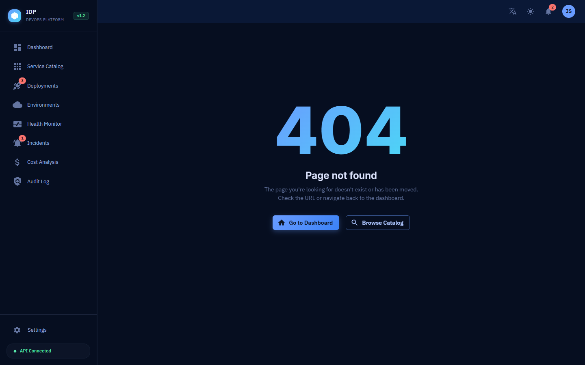
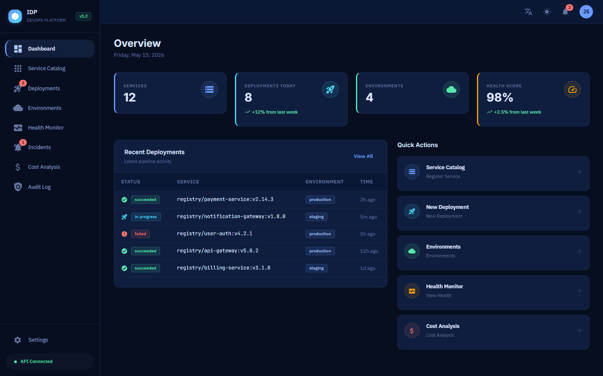
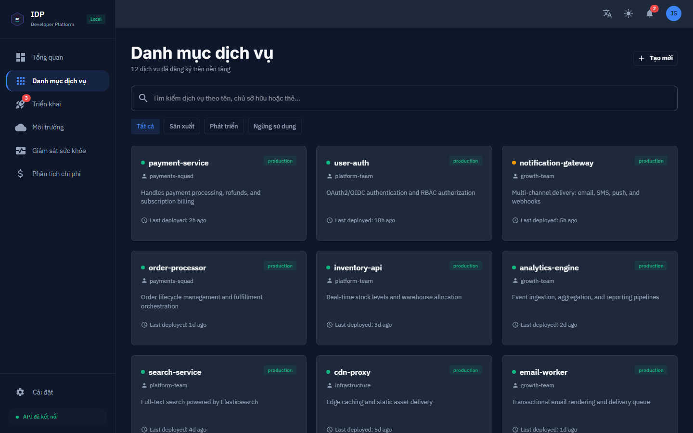
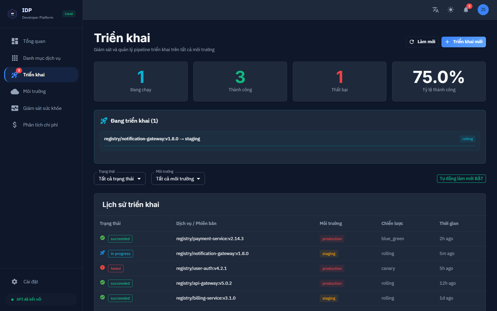
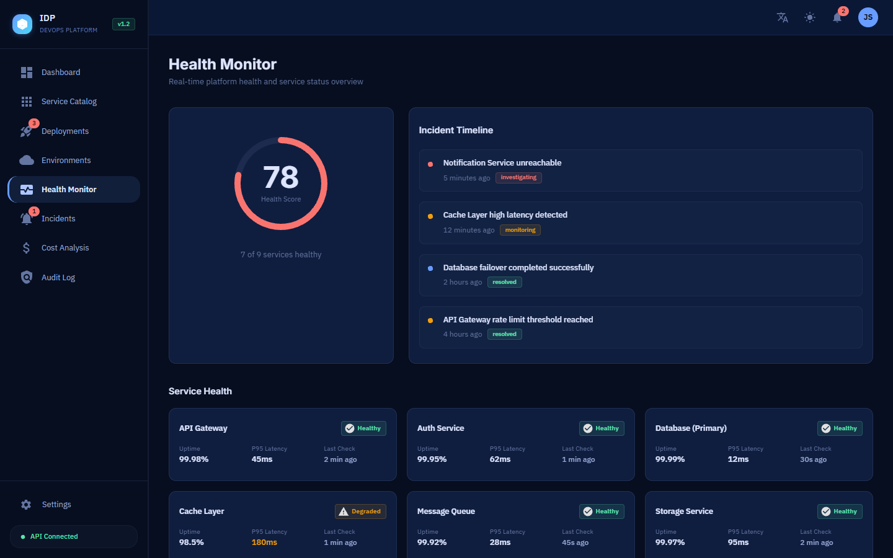
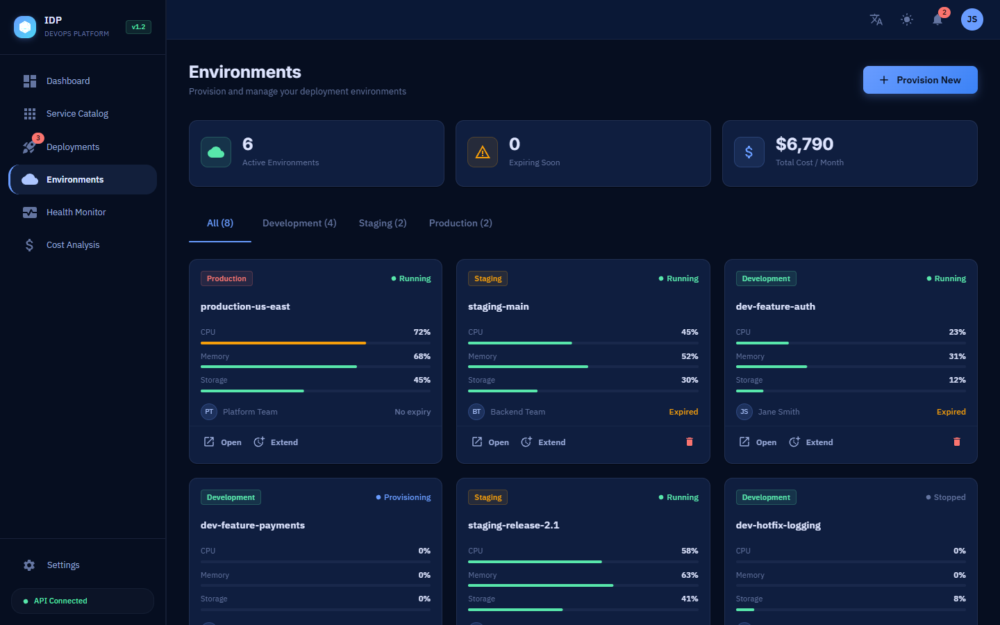

# Internal Developer Platform (IDP)

**Enterprise-grade platform engineering solution for modern DevOps teams**

[](https://github.com/JasonTM17/Internal_Developer_Platform_DevOps/actions/workflows/ci.yaml)
[](https://github.com/JasonTM17/Internal_Developer_Platform_DevOps/actions/workflows/security-scan.yaml)
[](https://github.com/JasonTM17/Internal_Developer_Platform_DevOps/blob/main/LICENSE)


---

## Overview

A production-ready Internal Developer Platform that enables engineering teams to self-service infrastructure provisioning, application deployments, and environment management through a unified portal. Built with cloud-native principles, GitOps workflows, and enterprise security patterns.

### Key Highlights

- **14 GitHub Actions workflows** covering CI, CD, security scanning, and compliance
- **10 Terraform modules** for AWS infrastructure provisioning (EKS, RDS, ElastiCache, VPC)
- **Full Kubernetes stack** with Istio service mesh, Flagger canary deployments, and chaos engineering
- **Event-driven architecture** using NATS JetStream for real-time deployment notifications
- **Comprehensive documentation** including ADRs, runbooks, SLOs, and onboarding guides
- **Monorepo with Turborepo** for optimized builds with remote caching

---

## Portal Preview

> Self-service UI for managing services, deployments, and environments.

|                     Login                      |                       Dashboard                        |                  Service Catalog                   |
| :--------------------------------------------: | :----------------------------------------------------: | :------------------------------------------------: |
|  |  |  |

|                        Deployments                         |                Health Monitoring                 |                         Environments                         |
| :--------------------------------------------------------: | :----------------------------------------------: | :----------------------------------------------------------: |
|  |  |  |

---

## Architecture

```
┌─────────────────────────────────────────────────────────────────────────┐
│                         Developer Portal (React)                         │
│                    Self-Service UI • Service Catalog                      │
└──────────────────────────────────┬──────────────────────────────────────┘
                                   │ HTTPS/WSS
┌──────────────────────────────────▼──────────────────────────────────────┐
│                          API Gateway (Node.js)                            │
│              Auth • RBAC • Rate Limiting • Audit Logging                  │
└───────┬──────────────┬──────────────┬──────────────┬────────────────────┘
        │              │              │              │
   ┌────▼────┐   ┌────▼────┐   ┌────▼────┐   ┌────▼────┐
   │ Service │   │  Infra  │   │  Deploy │   │  Config │
   │ Catalog │   │Provision│   │  Engine │   │  Mgmt   │
   └────┬────┘   └────┬────┘   └────┬────┘   └────┬────┘
        │              │              │              │
┌───────▼──────────────▼──────────────▼──────────────▼────────────────────┐
│                        Infrastructure Layer                               │
│  ┌──────────┐  ┌──────────┐  ┌──────────┐  ┌──────────┐  ┌──────────┐  │
│  │Kubernetes│  │Terraform │  │  ArgoCD  │  │PostgreSQL│  │  Redis   │  │
│  │  (EKS)  │  │  (IaC)   │  │ (GitOps) │  │   (DB)   │  │ (Cache)  │  │
│  └──────────┘  └──────────┘  └──────────┘  └──────────┘  └──────────┘  │
└─────────────────────────────────────────────────────────────────────────┘
┌─────────────────────────────────────────────────────────────────────────┐
│                        Observability Stack                                │
│         Prometheus • Grafana • Loki • AlertManager • Jaeger              │
└─────────────────────────────────────────────────────────────────────────┘
```

---

## Features

| Category                   | Features                                                         |
| -------------------------- | ---------------------------------------------------------------- |
| **Self-Service Portal**    | Service catalog, one-click deployments, environment provisioning |
| **Security & Compliance**  | RBAC, audit logging, secret management, vulnerability scanning   |
| **Infrastructure as Code** | Terraform modules, Kubernetes manifests, GitOps with ArgoCD      |
| **CI/CD Pipelines**        | Multi-stage builds, automated testing, canary deployments        |
| **Observability**          | Prometheus metrics, Grafana dashboards, distributed tracing      |
| **Notifications**          | Real-time WebSocket updates, Slack integration, PagerDuty        |
| **Multi-Environment**      | Dev, staging, production with automated promotion workflows      |
| **Service Mesh**           | Istio for traffic management, mTLS, and observability            |
| **Chaos Engineering**      | LitmusChaos experiments for resilience testing                   |
| **Performance**            | Turborepo caching, Docker layer optimization, CDN integration    |

---

## Quick Start

### Prerequisites

- Docker and Docker Compose v2.20+
- Node.js >= 20.0.0
- pnpm >= 8.0.0

### Using Docker Compose (Recommended)

```bash
# Clone the repository
git clone https://github.com/JasonTM17/Internal_Developer_Platform_DevOps.git
cd Internal_Developer_Platform_DevOps

# Copy environment configuration
cp .env.example .env

# Start all services
docker compose up -d

# Access the platform
# Portal:  http://localhost:5173
# API:     http://localhost:3000
# Grafana: http://localhost:3001
```

### Local Development

```bash
# Install dependencies
pnpm install

# Start development servers
pnpm dev

# Run tests
pnpm test

# Build all packages
pnpm build
```

---

## Tech Stack

| Layer                       | Technology                   | Purpose                        |
| --------------------------- | ---------------------------- | ------------------------------ |
| **Frontend**                | React 18, TypeScript, Vite   | Developer portal UI            |
| **Backend**                 | Node.js, Express, TypeScript | API server                     |
| **Database**                | PostgreSQL 16                | Primary data store             |
| **Cache & Queues**          | Redis 7, BullMQ              | Session management, job queues |
| **Event Bus**               | NATS JetStream               | Async event-driven messaging   |
| **Container Orchestration** | Kubernetes (EKS)             | Production workloads           |
| **Service Mesh**            | Istio                        | Traffic management, mTLS       |
| **Infrastructure as Code**  | Terraform                    | Cloud resource provisioning    |
| **GitOps**                  | ArgoCD                       | Continuous deployment          |
| **CI/CD**                   | GitHub Actions               | Build, test, deploy pipelines  |
| **Monitoring**              | Prometheus, Grafana          | Metrics and dashboards         |
| **Logging**                 | Loki, Promtail               | Centralized log aggregation    |
| **Tracing**                 | Jaeger, OpenTelemetry        | Distributed tracing            |
| **Security**                | Trivy, Snyk, CodeQL          | Vulnerability scanning         |
| **Monorepo**                | Turborepo, pnpm              | Build orchestration            |
| **Testing**                 | Vitest, Playwright           | Unit, integration, E2E         |
| **Code Quality**            | ESLint, Prettier, Husky      | Linting and formatting         |

---

## Project Structure

```
├── apps/
│   ├── api/                    # Backend API service (Express + TypeScript)
│   └── portal/                 # Frontend developer portal (React + Vite)
├── packages/
│   ├── shared/                 # Shared utilities and types
│   ├── ui/                     # Shared UI component library
│   └── config/                 # Shared ESLint, TypeScript, Prettier configs
├── infra/
│   ├── terraform/              # 10 IaC modules (EKS, RDS, VPC, IAM, etc.)
│   ├── kubernetes/             # K8s manifests and Helm charts
│   ├── argocd/                 # GitOps application definitions
│   ├── istio/                  # Service mesh configuration
│   ├── flagger/                # Canary deployment automation
│   ├── chaos/                  # LitmusChaos experiments
│   └── monitoring/             # Prometheus, Grafana, Loki, Jaeger
├── docs/
│   ├── adr/                    # 10 Architecture Decision Records
│   ├── api/                    # OpenAPI 3.1 spec + auth/pagination docs
│   ├── architecture/           # Technology radar, system diagrams
│   ├── runbooks/               # Disaster recovery, incident response
│   ├── slo/                    # Service Level Objectives
│   └── onboarding/             # Developer onboarding guides
├── scripts/                    # Automation and utility scripts
├── .github/
│   ├── workflows/              # 14 CI/CD pipeline definitions
│   └── ISSUE_TEMPLATE/         # Issue and PR templates
├── docker-compose.yaml         # Local development environment
├── turbo.json                  # Turborepo pipeline configuration
└── pnpm-workspace.yaml         # Monorepo workspace definition
```

---

## CI/CD Pipelines

| Workflow             | Trigger                | Purpose                                   |
| -------------------- | ---------------------- | ----------------------------------------- |
| **CI**               | Push, PR               | Lint, test, build, type-check             |
| **Docker Build**     | Tags, Dockerfile edits | Multi-service container builds to GHCR    |
| **Security Scan**    | Weekly + manual        | Trivy, Snyk, CodeQL, TruffleHog, Gitleaks |
| **CD Dev**           | Push to develop        | Auto-deploy to development environment    |
| **CD Staging**       | Push to release/\*     | Deploy to staging with integration tests  |
| **CD Production**    | Manual approval        | Blue-green deploy with canary analysis    |
| **Terraform Plan**   | PR with infra changes  | Preview infrastructure changes            |
| **Terraform Apply**  | Merge to main          | Apply approved infrastructure changes     |
| **Release**          | Version tags           | Semantic versioning and changelog         |
| **Compliance Audit** | Weekly                 | License check, SBOM generation            |

---

## Deployment

### Environments

| Environment | Branch      | URL                    | Strategy        |
| ----------- | ----------- | ---------------------- | --------------- |
| Development | `develop`   | `dev.idp.internal`     | Auto on push    |
| Staging     | `release/*` | `staging.idp.internal` | Auto on push    |
| Production  | `main`      | `idp.internal`         | Canary + manual |

### Deployment Pipeline

```
Code Push → CI Pipeline → Build → Security Scan → Deploy to Dev
                                                        ↓
                                              Integration Tests
                                                        ↓
                                              Promote to Staging
                                                        ↓
                                              E2E Tests + Canary Analysis
                                                        ↓
                                              Deploy to Production (manual gate)
```

### Rollback

```bash
# Automatic rollback on failed health checks (via Flagger)
# Manual rollback via ArgoCD
argocd app rollback <app-name>

# Or via kubectl
kubectl rollout undo deployment/<deployment-name>
```

---

## Container Images

Published to GitHub Container Registry:

```
ghcr.io/jasontm17/internal_developer_platform_devops/idp-api:latest
ghcr.io/jasontm17/internal_developer_platform_devops/idp-portal:latest
```

Tagged releases:

```
ghcr.io/jasontm17/internal_developer_platform_devops/idp-api:v1.0.0
ghcr.io/jasontm17/internal_developer_platform_devops/idp-portal:v1.0.0
```

---

## Documentation

| Document                                         | Description                          |
| ------------------------------------------------ | ------------------------------------ |
| [Architecture Overview](docs/architecture/)      | System design and technology radar   |
| [API Documentation](docs/api/)                   | OpenAPI 3.1 spec and examples        |
| [ADR Records](docs/adr/)                         | 10 Architecture Decision Records     |
| [Operations Runbooks](docs/runbooks/)            | Disaster recovery, incident response |
| [SLO Definitions](docs/slo/)                     | Service Level Objectives             |
| [Onboarding Guide](docs/onboarding/)             | New developer setup guide            |
| [Security Policy](SECURITY.md)                   | Vulnerability reporting process      |
| [Contributing Guide](CONTRIBUTING.md)            | How to contribute                    |
| [Changelog](CHANGELOG.md)                        | Release history                      |
| [Release Process](docs/RELEASE_PROCESS.md)       | Versioning and release workflow      |
| [Branching Strategy](docs/BRANCHING_STRATEGY.md) | Git workflow documentation           |
| [Roadmap](docs/roadmap.md)                       | Feature roadmap and milestones       |

---

## Development Commands

```bash
# Development
pnpm dev                    # Start all services in dev mode
pnpm build                  # Build all packages
pnpm clean                  # Clean build artifacts

# Code Quality
pnpm lint                   # Run ESLint across all packages
pnpm lint:fix               # Auto-fix lint issues
pnpm format                 # Format code with Prettier
pnpm format:check           # Check formatting
pnpm typecheck              # TypeScript type checking

# Testing
pnpm test                   # Run all tests
pnpm test:unit              # Run unit tests only
pnpm test:integration       # Run integration tests

# Infrastructure
make terraform-plan         # Preview infrastructure changes
make terraform-apply        # Apply infrastructure changes
make k8s-deploy             # Deploy to Kubernetes
```

---

## Contributing

Contributions are welcome. See the [Contributing Guide](CONTRIBUTING.md) for details.

1. Fork the repository
2. Create your feature branch (`git checkout -b feature/amazing-feature`)
3. Commit your changes (`git commit -m 'feat: add amazing feature'`)
4. Push to the branch (`git push origin feature/amazing-feature`)
5. Open a Pull Request

### Commit Convention

This project uses [Conventional Commits](https://www.conventionalcommits.org/):

- `feat:` New features
- `fix:` Bug fixes
- `docs:` Documentation changes
- `chore:` Maintenance tasks
- `ci:` CI/CD changes
- `refactor:` Code refactoring
- `test:` Test additions/changes
- `perf:` Performance improvements

---

## License

This project is licensed under the MIT License. See the [LICENSE](LICENSE) file for details.
