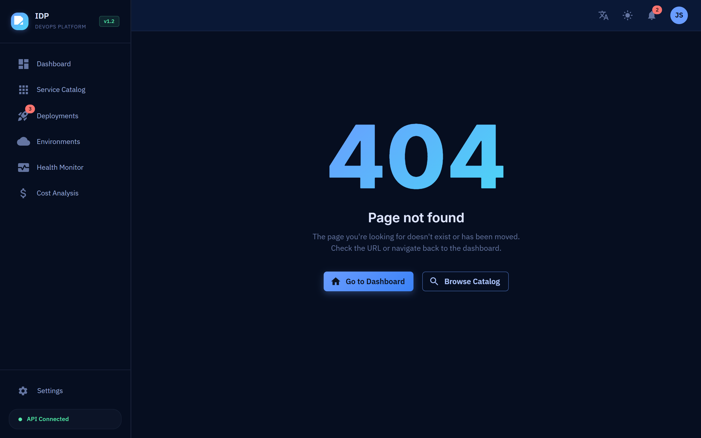
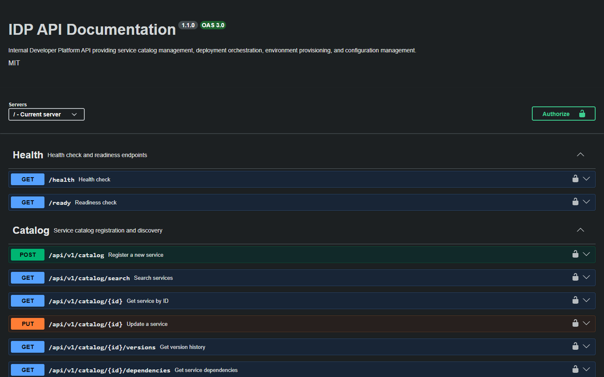
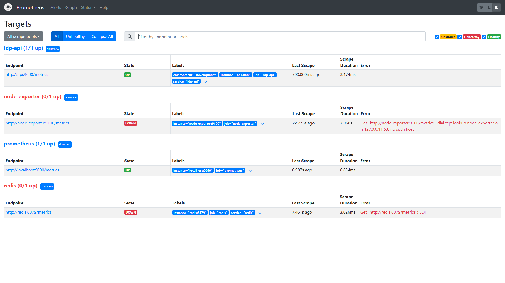

# Documentation Index

## Internal Developer Platform — Technical Documentation

This documentation set provides comprehensive coverage of the IDP's architecture, operations, and development practices. It is structured for both onboarding new engineers and serving as a reference for experienced platform operators.

---

## Table of Contents

### Architecture & Design

| Document                                                       | Scope                                            | Audience             |
| -------------------------------------------------------------- | ------------------------------------------------ | -------------------- |
| [Architecture Overview](architecture/README.md)                | System design, technology decisions, C4 diagrams | All engineers        |
| [System Context (C4 L1)](architecture/system-context.md)       | External actors and system boundaries            | Architects           |
| [Container Diagram (C4 L2)](architecture/container-diagram.md) | Internal container decomposition                 | Backend engineers    |
| [Deployment Diagram](architecture/deployment-diagram.md)       | Infrastructure topology                          | SRE / DevOps         |
| [Data Flow](architecture/data-flow.md)                         | Data movement between components                 | Backend engineers    |
| [Network Topology](architecture/network-topology.md)           | Network segmentation, service mesh               | SRE / Security       |
| [Security Architecture](architecture/security-architecture.md) | Defense-in-depth, trust boundaries               | Security engineers   |
| [Capacity Planning](architecture/capacity-planning.md)         | Scaling thresholds, resource projections         | SRE                  |
| [Technology Radar](architecture/technology-radar.md)           | Technology adoption lifecycle                    | All engineers        |
| [Architecture Overview (VI/EN)](architecture/overview-vi.md)   | Bilingual architecture summary                   | Vietnamese engineers |

### Architecture Decision Records (ADRs)

| ADR                                             | Title                                 | Status   |
| ----------------------------------------------- | ------------------------------------- | -------- |
| [ADR-001](adr/001-monorepo-structure.md)        | Monorepo with Turborepo               | Accepted |
| [ADR-002](adr/002-typescript-strict.md)         | TypeScript Strict Mode                | Accepted |
| [ADR-003](adr/003-gitops-argocd.md)             | GitOps with ArgoCD                    | Accepted |
| [ADR-004](adr/004-eks-over-ecs.md)              | EKS over ECS                          | Accepted |
| [ADR-005](adr/005-postgresql-primary-db.md)     | PostgreSQL as Primary Database        | Accepted |
| [ADR-006](adr/006-event-driven-deployments.md)  | Event-Driven Deployment Notifications | Accepted |
| [ADR-007](adr/007-rbac-team-scoped.md)          | Team-Scoped RBAC                      | Accepted |
| [ADR-008](adr/008-audit-hash-chain.md)          | Hash-Chain Audit Log                  | Accepted |
| [ADR-009](adr/009-helm-over-kustomize.md)       | Helm over Kustomize                   | Accepted |
| [ADR-010](adr/010-external-secrets-operator.md) | External Secrets Operator             | Accepted |

### API Documentation

| Document                                  | Description                       |
| ----------------------------------------- | --------------------------------- |
| [OpenAPI Specification](api/openapi.yaml) | OpenAPI 3.1 machine-readable spec |
| [API Guide (VI/EN)](api/api-guide-vi.md)  | Bilingual API usage guide         |

### Operations & Reliability

| Document                                                     | Description                                |
| ------------------------------------------------------------ | ------------------------------------------ |
| [Operations Guide (VI/EN)](operations/README.md)             | Day-to-day operational procedures          |
| [CI/CD Pipeline Guide (VI/EN)](operations/ci-cd-guide-vi.md) | Pipeline architecture and troubleshooting  |
| [SLO Definitions](slo/)                                      | Service Level Objectives and error budgets |
| [Incident Response Runbook](runbooks/)                       | Step-by-step incident handling             |
| [Disaster Recovery](runbooks/)                               | RTO/RPO targets and recovery procedures    |

### Developer Guides

| Document                                                    | Description                                    |
| ----------------------------------------------------------- | ---------------------------------------------- |
| [Getting Started](onboarding/getting-started.md)            | Local setup in under 30 minutes                |
| [Getting Started (VI/EN)](onboarding/getting-started-vi.md) | Bilingual onboarding guide                     |
| [Contributing Guide](../CONTRIBUTING.md)                    | Code standards, PR process, commit conventions |
| [Branching Strategy](BRANCHING_STRATEGY.md)                 | Git workflow and environment mapping           |
| [Release Process](RELEASE_PROCESS.md)                       | Semantic versioning and release workflow       |

### Compliance & Security

| Document                           | Description                        |
| ---------------------------------- | ---------------------------------- |
| [Security Policy](../SECURITY.md)  | Vulnerability disclosure process   |
| [Compliance Controls](compliance/) | SOC2 mappings, data classification |

### Planning

| Document                | Description                      |
| ----------------------- | -------------------------------- |
| [Roadmap](roadmap.md)   | Feature roadmap and milestones   |
| [Glossary](glossary.md) | Platform terminology definitions |

---

## Platform Screenshots

### Developer Portal

|                   Login                   |                     Dashboard                     |                Service Catalog                |
| :---------------------------------------: | :-----------------------------------------------: | :-------------------------------------------: |
|  |  |  |

|                      Deployments                      |              Health Monitoring              |                      Environments                       |
| :---------------------------------------------------: | :-----------------------------------------: | :-----------------------------------------------------: |
|  |  |  |

### Observability Stack

|                 Grafana Home                  |                     Prometheus                      |                API Documentation                |
| :-------------------------------------------: | :-------------------------------------------------: | :---------------------------------------------: |
|  |  |  |

|                     Grafana Dashboards                     |                    Prometheus Targets                    |
| :--------------------------------------------------------: | :------------------------------------------------------: |
|  |  |

---

## Documentation Standards

- All documentation follows [Diátaxis](https://diataxis.fr/) framework (tutorials, how-to guides, reference, explanation)
- Architecture documents use [C4 Model](https://c4model.com/) notation
- ADRs follow [Michael Nygard's template](https://cognitect.com/blog/2011/11/15/documenting-architecture-decisions)
- Key documents are available in bilingual format (Vietnamese/English)
- Diagrams use ASCII art for version-control friendliness
